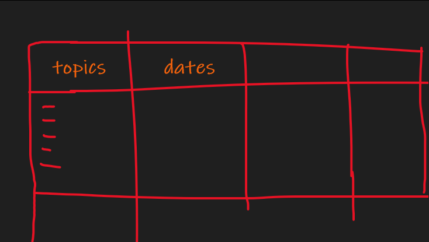

Hi Friend i hope u doing well 😁, Finnaly this exusting week has ended ⌛ *had philosophy exam🥱*

## Study 📚
I Learned a few stuff 🔧

1. have a study methodology 🧪

> watch alli abdal  

2. use anki for example and setup a google cheet contains topics that u will study 

3. prepar for the finnal exma *todo*

> a plan to get a good grade *next week*

## Podcasts 🎙️
I started listening to some podcats 😉 

### Why 
get inspired 
get ideas 
listen instead of reading 
learn stuff 

### Resources
[Aliabdaal video](https://www.youtube.com/watch?v=6x1i0K4Eg1g&ab_channel=AliAbdaal)

Not Overthinking - https://notoverthinking.com/
....

+ when 
at the morning ..

### I started ..

https://www.youtube.com/watch?v=nm1TxQj9IsQ&ab_channel=AndrewHuberman
Making my first million	
The knowledge project
[Hubermanlab](https://hubermanlab.com/category/podcast-episodes/)

 
## business 👨‍💼
A guy reach me out about making an app and i turned down  
The problems is when we setup a meeting he dont have an app idea ; he just want to make quick buck 

### meeting agenda
discuss the app idea ===> 

questions : 
	what are the features 
	mockups of the app before the beta version 
	budget depends on the app idea
	ask him about the budget he can afford
 
time structure 45 min: 
	5min to explain the main idea
	30min to understand it and calculate the budget ; and agree about smth
	10min questions 
expected outcoms : 
	atlest 2k budget 💰 (cost + labour time cost)

### Production steps
+ **steps to make the app** :  

	+ Generate an app idea
	+ Do competitive market research
	+ Write out the features for your app
	+ Make design mockups of your app
	+ Create your app’s graphic design
	+ Put together an app marketing plan
	+ Build the app with one of these options
	+ Submit your app to the App Store
	+ Market your app for maximum exposure
	+ Improve your app with user feedback

### Results
main idea > see locations of resutorents and public restorents 
wts the revenue ? > ads ??
i told him atleast 1k for beta app < denie 

what I learned : 
	learn negociation 
	do wt best for you 
	be prepared 

## Entertaiment -movies 🎥

- Dark knight rises {tom hardy carater well played }
<iframe src="../assets/img/2022-02-05-week-1md/1.mp4" frameborder="0" allowfullscreen></iframe>
- Dunkirk {WW2 when france was surrended by germans ; worth watching}
- Mad max {adventure stuff super nice}
- The revenant {to watch}
- The Kingsman 2 {learn how to dress well XD}
- Tenet {to watch}

## Entertaiment -cars 🚗

## Lessons from solved problems 👏
- dont rush (take your time in ur exam , in anything)
- be a monster , then controll it (dont be the nice guy)
- plan your challenges and start rowing (plan prevant lost)
- fake confidents (fake it untile u make it baby !!!) 
- do it anyway (lazy ppl like me ; million excuses but do it anyway)
- eat healthy and go to the gym (healthy diet and sport ; makes u more happy)

- if u cant solve a problem , then there is an easier probu can solve **FIND IT** (TRUE , IN ANY FIELD)
- push your brain to the limits 
- spend your time like u spend money (spend it wisely , btw i will add a finnace section next week inshallah)

## ✍️ Quote of the week 

⚡ "Never interrupt your enemy✌ when he is making a mistake" *napoleon* ⚡

**note 🔍**: 

I will probably rewrite this blog 📜

    

