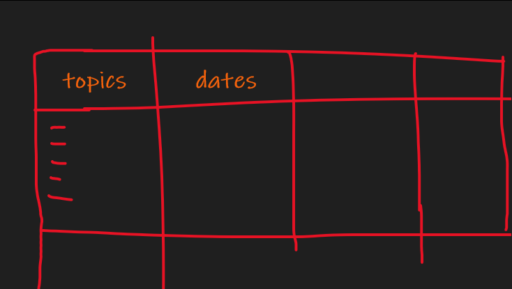

Hi Friend i hope u doing well , Finnaly this exusting week has ended 

## Study 
I Learned a few stuff 
1. have a study methodology 

> watch alli abdal  

2. use anki for example and setup a google cheet contains topics that u will study 

3. prepar for the finnal exma *todo*

> a plan to get a good grade *next week*

## Podcasts 
I started listening to some podcats :) 
====================================why==========================
get inspired 
get ideas 
listen instead of reading 
learn stuff 
================================resources========================
[https://www.youtube.com/watch?v=6x1i0K4Eg1g&ab_channel=AliAbdaal]

Not Overthinking - https://notoverthinking.com/
Deep Dive Podcast - https://www.youtube.com/c/DeepDivewit...

The Tim Ferriss Show - https://tim.blog/podcast/
The Knowledge Project - https://fs.blog/knowledge-podcast/
Deviate - https://rolfpotts.com/deviate/
Bookworm - https://bookworm.fm/
Invest like the Best - https://podcasts.apple.com/gb/podcast...
The North Star Podcast - https://perell.com/podcast/
The Art of Manliness - https://www.artofmanliness.com/podcast/
Impact Theory - https://impacttheory.com/episodes/
The School of Greatness - https://podcasts.apple.com/gb/podcast...
The Diary of a CEO - https://podcasts.apple.com/gb/podcast...
The Huberman Lab - https://hubermanlab.com/
My First Million - https://www.mfmpod.com/
Indie Hackers - https://www.indiehackers.com/podcasts
Noah Kagan Presents - https://okdork.com/podcast/
The Naval Podcast - https://nav.al/
Video Creators Podcast - https://videocreators.com/podcast/
The Gary Vee Audio Experience - https://www.garyvaynerchuk.com/podcast/
That Creative Life - https://www.thatcreative.life/
The Stalman Podcast - https://www.stalmanpodcast.com/
The Secret Podcast - https://podcasts.apple.com/us/podcast...
The Matti and Pete Show - https://www.mattiandpeteshow.com/
Tuxedo Time Podcast - https://www.youtube.com/c/thetuxedoti...
The Property Podcast - https://propertyhub.net/podcast/
Smart Passive Income - https://www.smartpassiveincome.com/li...

==================================when==========================
at the morning ..

==========================starting==============================
https://www.youtube.com/watch?v=nm1TxQj9IsQ&ab_channel=AndrewHuberman
making my first million
	
the knowledge project
hubermanlab

========================to start===============================
https://hubermanlab.com/category/podcast-episodes/

 
## business 
A guy reach me out about making an app and i turned down  
The problems is when we setup a meeting he dont have an app idea ; he just want to make quick buck 

========================meeting agenda=================
discuss the app idea ===> 

questions : 
	what are the features 
	mockups of the app before the beta version 
	budget depends on the app idea
	ask him about the budget he can afford
 
time structure 45 min: 
	5min to explain the main idea
	30min to understand it and calculate the budget ; and agree about smth
	10min questions 
outcams : 
	atlest 2k budget 

=================Production steps=======================
+ **steps to make the app** :  

	+ Generate an app idea
	+ Do competitive market research
	+ Write out the features for your app
	+ Make design mockups of your app
	+ Create your app’s graphic design
	+ Put together an app marketing plan
	+ Build the app with one of these options
	+ Submit your app to the App Store
	+ Market your app for maximum exposure
	+ Improve your app with user feedback

=======================Result=============================
main idea > see locations of resutorents and public restorents 
wts the revenue ? > ads ??
i told him atleast 1k for beta app < denie 

what I learned : 
	learn negociation 
	do wt best for you 
	be prepared 

## Entertaiment -movies 

- Dark knight rises {tom hardy carater well played }

- Dunkirk {WW2 when france was surrended by germans ; worth watching}
- Mad max {adventure stuff super nice}
- The revenant {to watch}
- The Kingsman 2 {learn how to dress well XD}
- Tenet {to watch}

## Lessons from solved problems 
- dont rush (take your time in ur exam , in anything)
- be a monster , then controll it (dont be the nice guy)
- plan your challenges and start rowing (plan prevant lost)
- fake confidents (fake it untile u make it baby !!!) 
- do it anyway (lazy ppl like me ; million excuses but do it anyway)
- eat healthy and go to the gym (healthy diet and sport ; makes u more happy)
- if u cant solve a problem , then there is an easier probu can solve **FIND IT** (TRUE , IN ANY FIELD)
- push your brain to the limits 
- spend your time like u spend money (spend it wisely , btw i will add a finnace section next week inshallah)

## Quote 

"Never interrupt your enemy when he is making a mistake" *napoleon*

**note**: 
I will probably rewrite this blog :) 