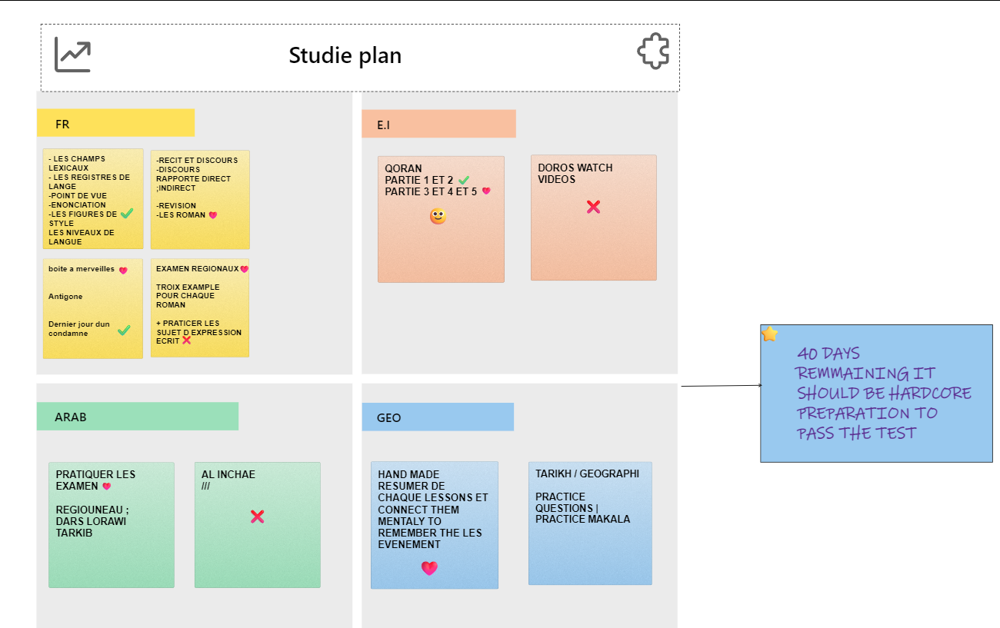

# brrrrrrrrrrrrrr

**remake a paper version contain all the lessons and learn them connect them then cross them then revise them then test ur self then ur done**

## TLD;R 

study (work hard), pray/ chess / workout at home (rest), sleep (rest)

## Conc 
yesterday & today i did that exam , i was happy about answering most of the questions and remmember allah dont waste ur work it counts and i should dig in islam and pray and be a true muslime cuz that will help me be a better person rather than fapping and doing nothing hoping for a mericale ; my goals are simple and clear i want to acheive them to satisfy my self not others  
*remember THE PSP (rawane) STORY U GOTTA GRIND TO FIND*

    

    
    
    
    

